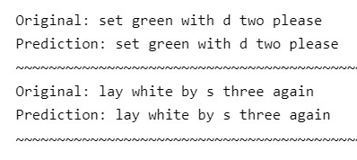
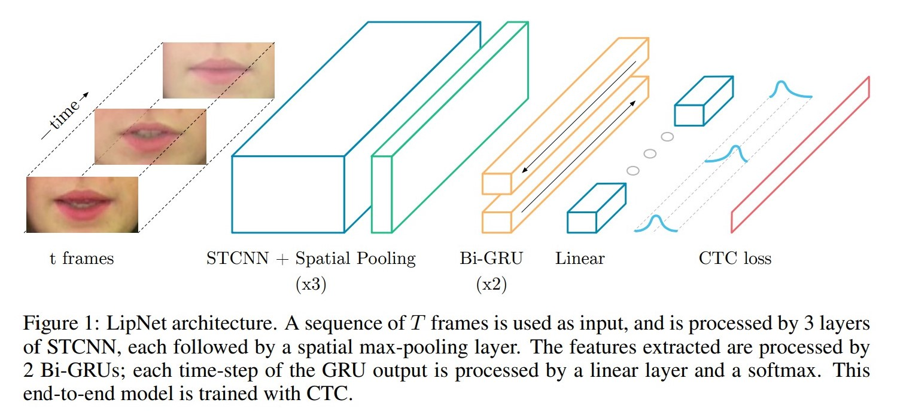
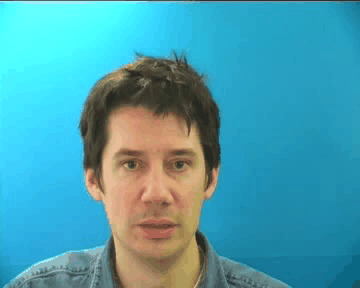

# LipNet: Lip-Reading Deep Neural Network

## Introduction

Welcome to my implementation of a Lip-Reading Deep Neural Network!

It is based on the LipNet architecture, a pioneering model that connects the fields of computer vision, natural language processing (NLP), and speech recognition.

LipNet is a character-based model, meaning its capability is not restricted to the words it has already been trained on. It can therefore decode words that it has never seen before.

My trained model successfully predicted spoken words from lip movements. It was accurate in testing with both preprocessed video data similar to what it was trained, on and unprocessed video clips.

<kbd>
  
</kbd>

## Background

LipNet, introduced in the paper [LipNet: End-to-End Sentence-Level Lipreading](https://arxiv.org/abs/1611.01599), addresses the problem of lip-reading, a challenging task with applications in speech recognition and communication assistance.

It combines 3D Convolutional Neural Networks (CNNs) for video processing with Recurrent Neural Networks (RNNs), specifically Long Short-Term Memory (LSTM) networks, to recognize spoken words from lip movements.

By bridging the gap between vision and spoken language, LipNet can be a valuable tool in various domains.

## Dataset
In this project, I used a lip-reading training dataset created by Nicholas Renotte, derived from the larger GRID dataset (https://paperswithcode.com/dataset/grid).

This dataset includes video clips of a single speaker pronouncing words along with corresponding annotations. These annotations served as the ground truth for training and evaluation.

A GIF sample from one of the clips:

## Key Steps
Here are the main steps and components of my implementation:

1. **Data Loading**: Downloaded and inspected the dataset consisting of video clips and their corresponding annotations.

2. **Vocabulary Definition**: Defined a vocabulary of characters, which is essential for converting lip-read data into a format suitable for training.

3. **Video Preprocessing**: Extracted the region of interest (the mouth/lip area) from the video frames and standardized its pixel values for input to the neural network. A GIF consisting of preprocessed video frames:

4. **Alignment Processing**: Converted the characters in the alignments/annotations into numerical tokens for model training.

5. **Data Pipeline**: Created a data pipeline that loads video frames and alignments simultaneously, ensuring they are correctly paired for training.

6. **Neural Network Architecture**: Built a 3D CNN based on the LipNet architecture consisting of convolutional, bidirectional LSTM, and time-distributed layers.

7. **Training**: Trained the LipNet model using Connectionist Temporal Classification (CTC) loss, a common loss function in speech recognition tasks. Also implemented learning rate scheduling to improve training efficiency.

8. **Model Evaluation**: Evaluated the model's performance on preprocessed and unprocessed video data, demonstrating its lip-reading capabilities.

## Learning Outcomes
Working on this project, I gained valuable experience in various aspects of NLP, data science, and deep learning such as data preprocessing, 3D convolution, LSTMs, and loss function implementation.

The project also allowed me to demonstrate deep learning's potential to enhance accessibility across the spectrum of communication abilities. This is something I have been working towards since my early American Sign Language character classification models.

## Future Work
**Optimizing Training**: Training the model was an 11+ hour, computationally intensive task. I would like to investigate methods to accelerate the training process without sacrificing prediction accuracy or simply increasing compute power.

 **Deployment**: I want to explore how to deploy the trained model using frameworks like Flask or StreamLit to create a lip-reading application that can assist people with speech or hearing impairments.

Continued development can further extend the impact of LipNet in making communication more inclusive and accessible for all. Thank you for joining me on this journey!

## Credits
**LipNet: End-to-End Sentence-level Lipreading**, by Yannis M. Assael, Brendan Shillingford, Shimon Whiteson, Nando de Freitas (https://arxiv.org/abs/1611.01599v2)

**Nicholas Renotte** (https://www.linkedin.com/in/nicholasrenotte)

**Automatic Speech Recognition using CTC**, by Mohamed Reda Bouadjenek and Ngoc Dung Huynh (https://keras.io/examples/audio/ctc_asr/)
